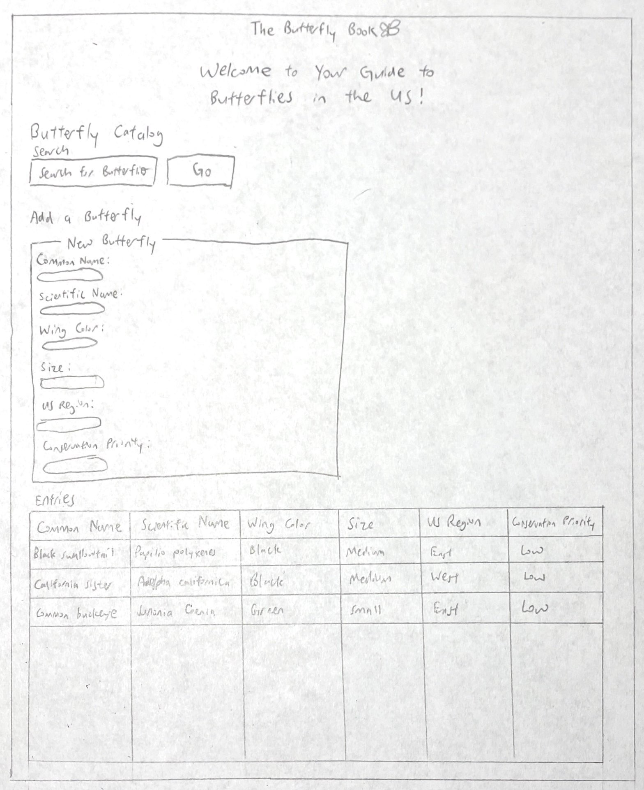
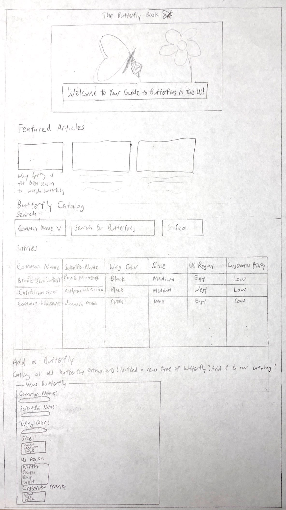
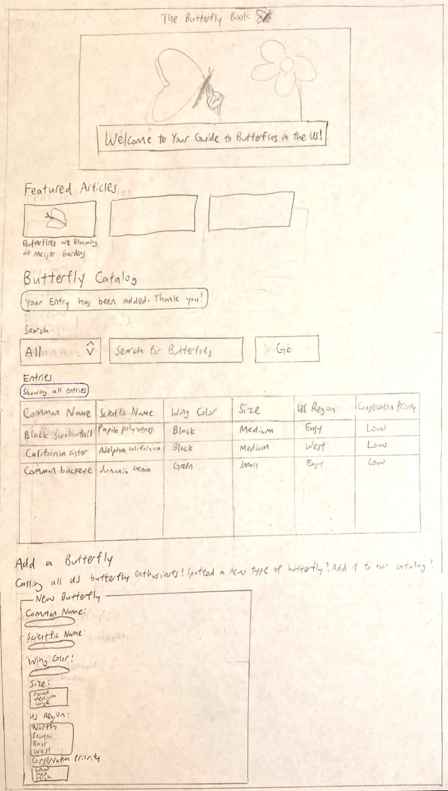

# Project 2: Design Journey

Be clear and concise in your writing. Bullets points are encouraged.

**Everything, including images, must be visible in VS Code's Markdown Preview.** If it's not visible in Markdown Preview, then we won't grade it.

## Catalog (Milestone 1)

### Describe your Catalog (Milestone 1)
> What will your collection be about? What types of attributes will you keep track of for the *things* in your catalog? 1-2 sentences.

- My collection will be a guide to the butterflies of North America. The attributes used are a butterfly's common name (as primary key), family, color, maximum size, habitat and range.

### Target Audience(s) (Milestone 1)
> Tell us about your target audience(s).

- I am targeting butterfly enthusiasts in the US, which include butterfly spotters, nature photographers, butterfly conservationists and insect specimen collectors. This target audience has a keen interest in learning about the similarities and differences between various types of butterflies, and would thus love to have a butterfly catalog to refer to. Butterfly enthusiasts may also like to have information on the color and size of butterflies to help identify what they are seeing.

### Design Patterns (Milestone 1)
> Review some existing catalog that are similar to yours. List the catalog's you reviewed here. Write a small reflection on how you might use the design patterns you identified in your review in your own catalog.

- **Butterflies and Moths of North America (https://www.butterfliesandmoths.org/gallery)**: This catalog is similar to an image gallery, and is thus not directly applicable to this project in the design aspect. However, it has a useful search bar that allows users to search for butterflies by species, family, region, etc--categories that I could adapt to my website's search function. An issue I have with this catalog is that there are multiple entries of butterflies with the same common name (e.g. dull firetip), thus crowding out the screen with the same type of butterfly instead of exposing users to a range of butterfly types.

- **Identify a Butterfly (https://butterfly-conservation.org/butterflies/identify-a-butterfly)**: This catalog serves the explicit purpose of helping people identify butterflies, thus the search bar allows users to filter by 4 categories--country, size, color and markings. Upon clicking on individual butterfly entries, I can see more information on the specific butterfly, such as its family, conservation status and food types. A deliberate choice has been made here to exclude these categories from the search bar, which helps make the search bar less cluttered. I feel that a balance has to be struck between allowing users to adequately specify their search and ensuring that the search bar is not cluttered with non-essential controls, and I will keep this in mind when integrating search into my own catalog.

- **Discover Life (https://www.discoverlife.org/mp/20q?guide=Butterflies)**: This catalog sorts the butterflies using 33 categories, including hindwing underside pattern, hindwing spot number and presence of white spots on wing. This large number of categories makes searching for a butterfly unnecessarily complex. The results of the search appear in a long list of species names (instead of easier-to-read common names) on the left side of the page, which could overwhelm a user. Furthermore, there is a "simplify search" button on the left side of the screen without proper instructions on how to use that button. Overall, what I have learned from this catalog is that it is important to make the search feature simpler, to avoid using Latin names that might obfuscate the user and to explain how less intuitive buttons (e.g. "simplify search") work.


## Design & Planning (Milestone 2)

## Design Process (Milestone 2)
> Document your design process. Show us the evolution of your design from your first idea (sketch) to design you wish to implement (sketch). Show us the process you used to organize content and plan the navigation, if applicable.
> Label all images. All labels must be visible in VS Code's Markdown Preview.
> Clearly label the final design.


*Initial Web Page Sketch* <br />
**Description:** This was my preliminary idea for the web page. The search bar, near the top of the page, allows butterfly enthusiasts to search for butterflies without any filters (taking the lesson from Milestone 1 that too many filters may clutter the page quite seriously). The search bar is followed by an "Add a Butterfly" section, where users can add a new  butterfly to the catalog. Finally, the entries of the butterfly catalog are listed in a table below the "Add a Butterfly" section. These entries are either all of the entries or the results of the search (if the "Go" button in the search bar has been pressed). The table has a large width that covers most of the page, as some of the entry strings may be quite long and require the cells of the table to be wide enough.


*Intermediate Web Page Sketch* <br />
**Description:** I added a feature photo of an orange butterfly near the top of the page in order to grab the attention of butterfly enthusiasts, who are naturally drawn to images of butterflies. I also decided to add a "Featured Articles" section that would feature 3 relevant articles on butterflies to capture the attention of butterfly enthusiasts. As for the butterfly catalog, I decided to rearrange the "Entries" section to be directly under the "Search" section, so that butterfly enthusiasts can access the results of their search more easily. The "Add a Butterfly" section can be placed at the bottom of the page, since the chances of a butterfly enthusiast discovering a new type of butterfly in the US are quite slim.


*Final Web Page Sketch* <br />

**Description:** Whenever users add an entry to the form, they will be redirected to the top of the "Butterfly Catalog" section, where they will be able to see all entries in the table as well as a message saying whether their entry has been added successfully (e.g. "Your entry has been added. Thank you!). This helps butterfly enthusiasts to check if their entry has been successfully added at once glance. Another change I made in the final sketch was to indicate to users whether the table is "showing all entries" or "showing search results", which allows them to observe if their search is narrowing down the entries according to their preferences (versus still displaying all entries)

## Partials (Milestone 2)
> If you have any partials, plan them here.


## Database Schema (Milestone 2)
> Describe the structure of your database. You may use words or a picture. A bulleted list is probably the simplest way to do this. Make sure you include constraints for each field.

```
Table: catalog {
    id: INTEGER {PK, U, Not, AI},
    common_name: TEXT {Not, U},
    scientific_name: TEXT {Not, U},
    wing_color: TEXT,
    size: TEXT,
    us_region: TEXT,
    conservation_priority: TEXT
```

## Database Query Plan (Milestone 2)
> Plan your database queries. You may use natural language, pseudocode, or SQL.]

1. All records

    ```
    Select all records and all fields from the catalog table. Assign an empty array to $params.
    ```

2. Search records

    For searching in all categories:
    ```
    Select all records where any of the 6 fields is like the string the user enters in the search bar (use the wildcard character). Assign an associative array with the key-value pair of ':search'-$search to $params.
    ```
    For searching in a chosen category:
    ```
    Select all records where the field chosen by the user (e.g. common name) is like the string the user enters in the search bar (use the wildcard character). Assign an associative array with the key-value pair of ':search'-$search to $params.
    ```

3. Insert record

    ```
    Insert into the butterflies table a single record matching the all columns except ID (as specified in the Add Form). Assign an associative array to $params with the key of each category's variable (e.g. $common_name) being its parameter marker.
    ```


## Code Planning (Milestone 2)
> Plan any PHP code you'll need here.

To access all records:
```
$sql = "SELECT * FROM catalog";
$params = array();
```

To search for records from all categories:
```
$sql = "SELECT * FROM catalog WHERE common_name LIKE '%' || :search || '%' OR scientific_name LIKE '%' || :search || '%' OR wing_color LIKE '%' || :search || '%' OR size LIKE '%' || :search || '%' OR us_region LIKE '%' || :search || '%' OR conservation_priority LIKE '%' || :search || '%'";
$params = array(':search' => $search);
```

To search for records from a specific category:
```
$sql = "SELECT * FROM catalog WHERE $search_field LIKE '%' || :search || '%'";
$params = array(':search' => $search);
```

To add a record:
```
$sql = "INSERT INTO catalog (common_name, scientific_name, wing_color, size, us_region, conservation_priority) VALUES (:common_name, :scientific_name, :wing_color, :size, :us_region, :conservation_priority)";
$params = array(':common_name'=>$common_name, ':scientific_name'=>$scientific_name, ':wing_color'=>$wing_color, ':size'=>$size, ':us_region'=>$us_region, ':conservation_priority'=>$conservation_priority);
$result = exec_sql_query($db, $sql, $params);
```

# Reflection (Final Submission)
> Take this time to reflect on what you learned during this assignment. How have you improved since Project 1? What things did you have trouble with?

**Learnings and Improvements**
- I learned about the widespread applicability of filtering input and escaping output, by applying it to a new context (databases). Given that a database may store all of the information in one table, it is essential that nefarious actors are prevented from accessing/deleting the data in one fell swoop. Filtering input and escaping output is hence crucial.
- As compared to Project 1, this website is a leap forward in terms of engaging the website user. This allows users to search for content that they are specifically interested in, and to add entries to contribute to shared knowledge. Hence, this website is definitely more appealing to users with specific interests (e.g. butterfly enthusiasts with a particular interest in small butterflies) who may not have the patience to trawl the entire web page for the information they need.
- The form on this website builds on what I learned in Project 1 about filtering input from users. This form has the added functionality of enforcing that data in certain fields (i.e. common name and scientific name) have been entered before a database entry can be added.

**Struggles**
- I struggled with the concept of PDO Prepared Statements initially, but was able to overcome the challenge after practicing what I had learned in Lab 6.
- Given that I don't have any butterfly enthusiasts as friends, I had to look up a wide variety of websites and blogs on butterflies to better understand the needs and interests of my target audience (butterfly enthusiasts in the US).
